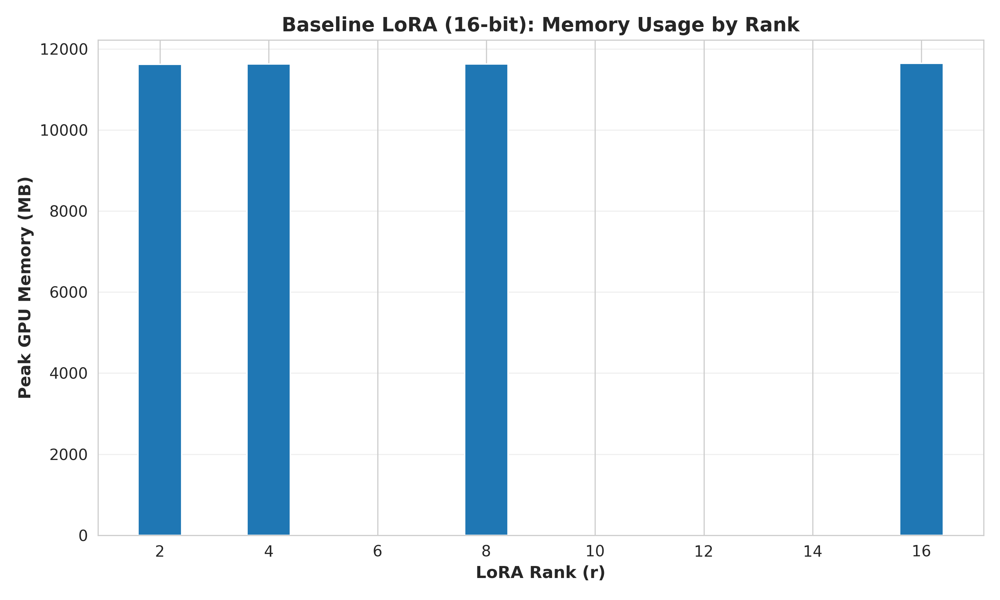
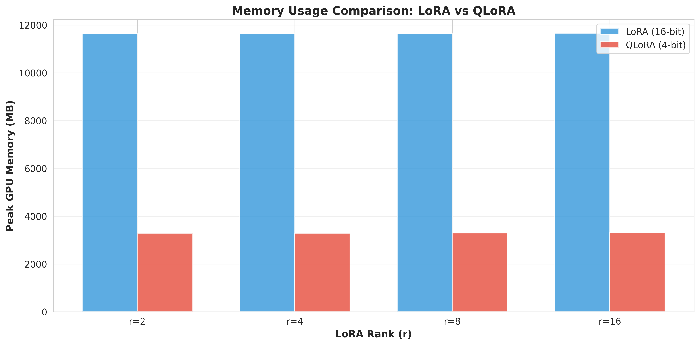
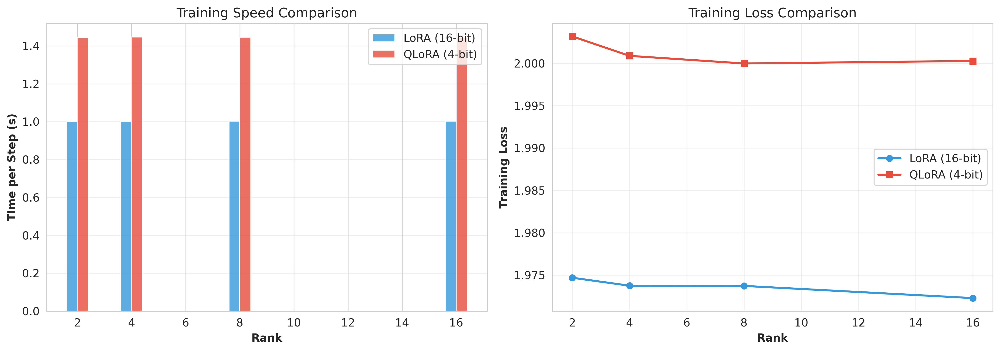
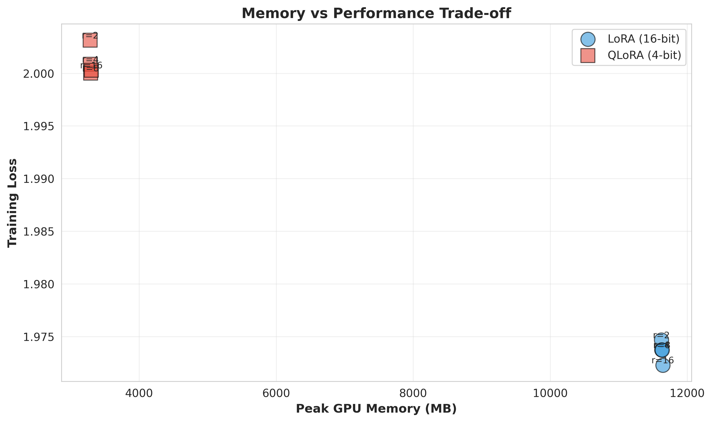
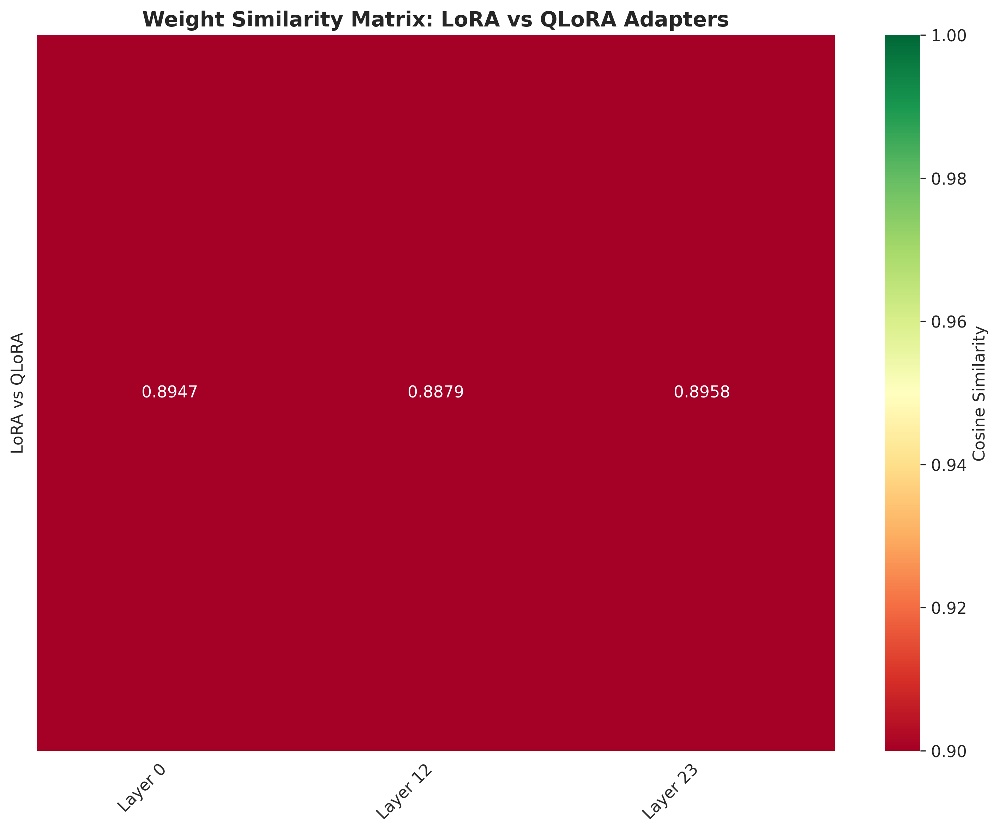
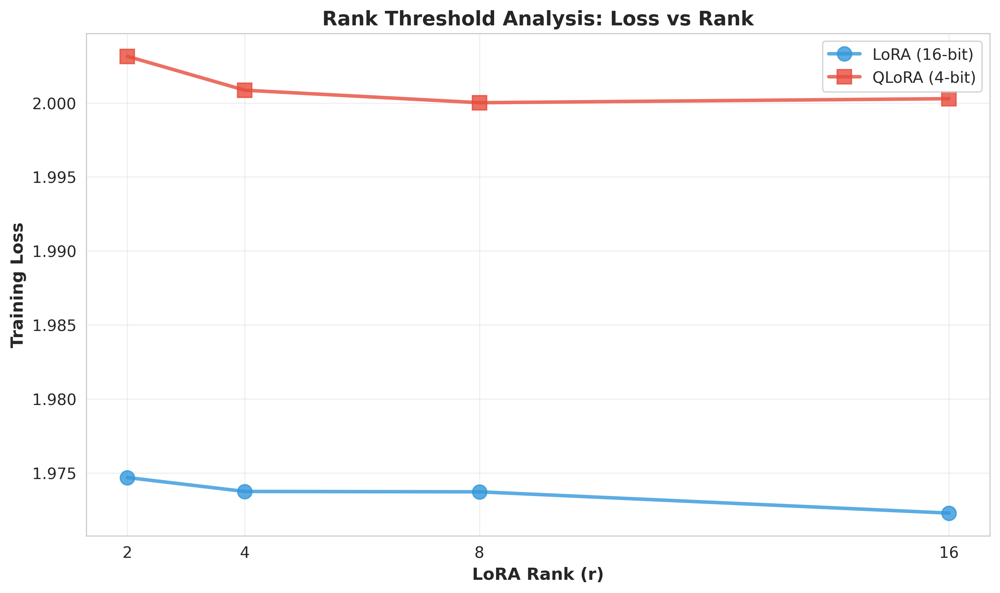

# QLoRA Diagnostic Analysis: When Does 4-Bit Quantization Preserve Quality?

**Caroline Ellis | DS 5690 Generative AI | Fall 2025**

[](https://www.python.org/downloads/)
[](https://opensource.org/licenses/MIT)
[](https://github.com/huggingface/peft)
[](https://github.com/psf/black)

---

## 📋 Table of Contents

1. [Problem Statement](#problem-statement)
2. [Key Research Questions](#key-research-questions)  
3. [Connection to Course Material](#connection-to-course-material)
4. [Methodology](#methodology)
5. [Implementation](#implementation)
6. [Experimental Results](#experimental-results)
7. [Diagnostic Analysis](#diagnostic-analysis)
8. [Critical Analysis & Impact](#critical-analysis-impact)
9. [Model & Data Information](#model-data-information)
10. [Ethical Considerations](#ethical-considerations)
11. [Resources & References](#resources-references)
12. [Quick Start Guide](#quick-start-guide)

---

## 🎯 Problem Statement

**The Challenge:** Full 16-bit fine-tuning of large language models requires prohibitive GPU memory. For example, fine-tuning LLaMA 65B requires **over 780 GB** of GPU memory, making it inaccessible to most researchers and practitioners.

**Existing Solutions:** Parameter-efficient methods like **LoRA (Low-Rank Adaptation)** reduce memory requirements by freezing pre-trained weights and training only small adapter matrices. However, even LoRA requires storing the full model in 16-bit precision.

**QLoRA's Promise:** By quantizing the frozen base model to **4-bit precision** while keeping adapters in high precision, QLoRA claims to enable fine-tuning of 65B models on a single 48GB GPU with minimal performance degradation.

**Critical Question:** 
> *Under what conditions does aggressive 4-bit quantization actually preserve model quality, and when does it fail?*

This project **diagnoses QLoRA's failure modes** and identifies **optimal configuration thresholds** through systematic experimentation, moving beyond the original paper's large-scale validation to provide **practical guidance for real-world deployment**.

---

# 🔬 Key Research Questions

This diagnostic analysis investigates three core hypotheses:

---

## **H1 — Quantization Impact Hypothesis**
> If weight differences between LoRA and QLoRA adapters are minimal (cosine similarity > 0.95), then QLoRA should always be preferred due to superior memory efficiency.

---

## **H2 — Rank Sensitivity Hypothesis**
> Lower LoRA ranks (r=2,4) should exhibit greater performance degradation under 4-bit quantization than higher ranks (r=8,16), because lower ranks have less capacity to absorb quantization noise.

---

## **H3 — Rank Threshold Hypothesis**
> There exists a minimum rank r* below which low-rank approximation becomes insufficient to compensate for quantization errors, regardless of other factors.

---

## 📚 Connection to Course Material

### Formal Algorithms Foundation  
This project builds directly on theoretical material from the course, specifically extending **Algorithm 13 (Transformer Training)** from *Formal Algorithms for Transformers in Natural Language Processing* (Phuong & Hutter, 2022). The core change is:  

- From full fine-tuning (all parameters) → low-rank adapter fine-tuning (LoRA)  
- From LoRA with full-precision base → quantized base + high-precision adapter (QLoRA)  

**Pseudocode (simplified):**  
```
# Standard LoRA
W' = W_frozen + α · B · A  # W_frozen stored in FP16  

# QLoRA Variant
W_q = quantize_nf4(W_frozen)  # 4-bit NF4 quantization  
W_fp16 = dequantize(W_q) on-the-fly during forward pass  
W' = W_fp16 + α · B · A  
```

This aligns with the formal update rules for transformer training, showing how quantization and low-rank adaptation interplay.  

Additionally, the use of low-rank adaptation directly maps to the course’s discussions of efficient parameter updates and memory/time complexity trade-offs in large models.

---

# 🔧 Methodology

## **Base Model**
- **GPT-2 Medium (355M parameters)**
- 24 decoder layers  
- 1024 hidden dimension  
- 16 attention heads  

Chosen because it is:
- Big enough to show meaningful quantization effects  
- Small enough to run on DGX Spark in a reasonable amount of time  

---

## **Dataset**
- **Stanford Alpaca** (52K instruction-response pairs)  
- Project used a **5,000-sample subset** for training speed
- Diverse tasks: translation, Q&A, summarization, categorization   

---

## **Training Configuration (DGX Spark)**
```
MODEL_NAME = "gpt2-medium"
NUM_SAMPLES = 5000
MAX_STEPS = 1000
BATCH_SIZE = 8
LEARNING_RATE = 2e-4
RANKS_TO_TEST = [2, 4, 8, 16]
```

---

## **Evaluation Metrics**
Metrics Summary Table
| Category | Metric | Unit | Purpose |
|----------|--------|------|---------|
| **Memory** | Peak GPU memory | MB | Quantify memory savings |
| **Performance** | Training loss | float | Core task performance |
| | Performance degradation | % | Quantization impact |
| **Weights** | Cosine similarity of adapter weights | float [-1,1] | Direct weight comparison |
| | Weight divergence patterns | per-layer | Identify failure modes |
| **Trade-offs** | Pareto frontier | plot | Optimal rank selection |

---
## 💻 Implementation

### Technical Innovations Leveraged (from QLoRA)
Our implementation leverages all three key QLoRA innovations described in Dettmers et al. (2023):

#### 1. **4-bit NormalFloat (NF4)**
```python
# NF4 quantization configuration
bnb_config = BitsAndBytesConfig(
    load_in_4bit=True,
    bnb_4bit_quant_type="nf4",  # Information-theoretically optimal
    bnb_4bit_compute_dtype=torch.bfloat16,
    bnb_4bit_use_double_quant=True  # See #2 below
)
```

**Why NF4?** For normally distributed weights, NF4 minimizes quantization error under the 4-bit constraint.

#### 2. **Double Quantization**
Quantizes the quantization constants themselves (stored in 8-bit FP8):
```
Standard: W_q (4-bit) + c (FP16) = 0.5625 bytes/parameter
Double:   W_q (4-bit) + c_q (FP8) + c2 (FP16) = 0.5537 bytes/parameter
```
Saves ~0.4 bytes per parameter → **critical at 65B scale** (~26 GB savings).

#### 3. **Paged Optimizers**
Handles gradient spikes by offloading optimizer states to CPU RAM (unified memory) when GPU memory exceeds threshold. Prevents OOM errors during training.

### Repository Structure

```
QLoRA-Project-Final/
├── README.md                          # This file (presentation document)
├── requirements.txt                   # Python dependencies
├── LICENSE                            # MIT License
│
├── notebooks/
│   ├── 01_baseline_lora.ipynb        # Baseline LoRA (16-bit) experiments
│   ├── 02_qlora_implementation.ipynb # QLoRA (4-bit) implementation
│   └── 03_diagnostic_analysis.ipynb  # Comprehensive diagnostic analysis
│   └── results_baseline_lora         # Notebook 01 result visuals
│   └── results_qlora/                # Notebook 02 result visuals
│   └── results/
│      ├── figures/                   # All plots and visualizations
│      └── tables/                    # CSV results tables
│
├── src/
│   ├── model_utils.py                # Model loading & LoRA/QLoRA setup
│   ├── training.py                   # Training loop with memory tracking
│   ├── evaluation.py                 # Evaluation metrics
│   └── visualization.py              # Plotting utilities
│
└── docs/
    ├── algorithm13_extension.md      # Formal pseudocode (Algorithm 13 + QLoRA)
    ├── model_card.md                 # Model card
    ├── data_card.md                  # Dataset card
    └── ethical_considerations.md     # Ethics & bias analysis
```
---

## 📊 Experimental Results
This section presents the empirical findings from the LoRA and QLoRA fine-tuning experiments conducted on **GPT-2 Medium (355M)** across ranks **{2, 4, 8, 16}** on the **Alpaca instruction-following dataset (5000 samples)**. Results include memory usage, training efficiency, weight similarity, and performance degradation analysis.

---

### 1. Baseline LoRA Scaling (16-bit)

#### 1.1 Memory vs Rank


*Raw LoRA baseline measurements are available in:*  
[`baseline_lora_results.csv`](notebooks/results_baseline_lora/baseline_lora_results.csv)

This plot shows **peak GPU memory usage (MB)** for **LoRA (16-bit)** at ranks `r ∈ {2,4,8,16}`.

* **What it shows:**

  * Memory usage is **dominated by the frozen 16-bit base model**, not the LoRA adapters.
  * As rank increases, memory grows **slightly**, but the curve is almost flat across ranks.
* **Why this happens:**

  * LoRA only adds small low-rank matrices `B ∈ ℝ^{d×r}` and `A ∈ ℝ^{r×d}` on top of the full 16-bit weights.
  * For GPT-2 Medium (355M), the adapter parameters are a tiny fraction of total parameters.
* **Significance:**

  * Even with LoRA, you still pay the **full 16-bit model cost** in memory.
  * This illustrates *why QLoRA is needed*: to attack the memory footprint of the frozen weights themselves rather than just the trainable adapters.

#### 1.2 Training Speed vs Rank


*Raw LoRA baseline measurements are available in:*  
[`baseline_lora_results.csv`](notebooks/results_baseline_lora/baseline_lora_results.csv)

This plot shows **time per training step (seconds)** for **LoRA (16-bit)** at each rank.

* **What it shows:**

  * Training speed changes only **slightly** as rank increases.
  * All ranks have similar step times; higher rank adds a bit of overhead but does not dominate runtime.
* **Why this happens:**

  * The main cost per step is still the **forward/backward pass through the base transformer**, not the small adapter matrices.
* **Significance:**

  * LoRA is **compute-efficient** across ranks.
  * Any large slowdowns we see later with QLoRA are therefore attributable to **quantization overhead**, not rank alone.

---

### 2. LoRA vs QLoRA: Memory Efficiency

#### 2.1 Per-Rank Comparison


*See the full degradation table here:*  
[`memory_comparison.csv`](notebooks/results/tables/memory_comparison.csv)


This figure compares **peak GPU memory usage** for LoRA (16-bit) vs QLoRA (4-bit NF4) across ranks.

* **What it shows:**

  * At **each rank** (`r=2,4,8,16`), QLoRA uses **substantially less GPU memory** than LoRA.
  * At **rank 8**, the diagnostic summary reports:

    * LoRA: **11,632.17 MB**
    * QLoRA: **3,292.09 MB**
    * → **71.7% memory reduction**
* **Why this happens:**

  * QLoRA stores the **frozen base model in 4-bit NF4**, plus double-quantized scaling factors, instead of 16-bit.
  * LoRA keeps the entire base model in **FP16** and only reduces the trainable portion.
* **Significance:**

  * This is the **core win** of QLoRA: you can fit the same model + adapters in **~28% of the memory** of 16-bit LoRA.
  * On larger models (e.g., 7B, 13B, 65B), the same pattern scales into **“possible vs impossible”** for many GPUs.

---

### 3. LoRA vs QLoRA: Training Efficiency

#### 3.1 Time per Step


*Generated from:*  
[`baseline_lora_results.csv`](notebooks/results_baseline_lora/baseline_lora_results.csv)
[`notebooks/results_qlora/qlora_results.csv`](notebooks/results_qlora/qlora_results.csv)


This dual-panel figure compares:

1. **Time per training step** for LoRA vs QLoRA by rank.
2. **Training loss** by rank for both methods.

At **rank 8**, the diagnostic summary reports:

* LoRA time/step: **1.002 s**

* QLoRA time/step: **1.445 s**

* → QLoRA is **~1.44× slower per step**.

* **What it shows:**

  * Across ranks, QLoRA consistently has **longer step times** than LoRA.
  * Loss curves remain **very close** between LoRA and QLoRA for all ranks.

* **Why this happens:**

  * QLoRA must:

    * Dequantize 4-bit weights on the fly (NF4 → bfloat16) for compute.
    * Use paged optimizers / extra indirections to manage quantized storage.
  * These operations add **runtime overhead**, especially on infrastructure like DGX where kernels and memory traffic are non-trivial.

* **Significance:**

  * There is a **clear trade-off**:

    * **LoRA** → faster steps, higher memory.
    * **QLoRA** → slower steps, much lower memory.
  * On a constrained GPU, the slowdown is often acceptable because the **alternative is “model doesn’t fit at all.”**

---

### 4. Overall Memory–Performance Trade-off

#### 4.1 Pareto Frontier


*Generated from:*  
[`baseline_lora_results.csv`](notebooks/results_baseline_lora/baseline_lora_results.csv)
[`notebooks/results_qlora/qlora_results.csv`](notebooks/results_qlora/qlora_results.csv)

This scatter plot shows each experiment (method × rank) as a point in **memory vs training loss** space:

* x-axis: **Peak GPU memory (MB)**

* y-axis: **Training loss**

* Circles: **LoRA (16-bit)**

* Squares: **QLoRA (4-bit)**

* Each point annotated with `r=<rank>`

* **What it shows:**

  * All points cluster in a narrow band of training loss (≈1.97–2.00).
  * QLoRA points are shifted far **left** (lower memory) with only a small shift **up** (slightly higher loss).
  * The **Pareto-optimal region** is the **lower-left**: low memory, low loss.
  * The **rank-8 QLoRA configuration** sits near this Pareto frontier (very low memory, minimal loss).

* **Why this happens:**

  * Quantization introduces **small additional loss**, but the model still retains most of its expressiveness.
  * Low-rank adapters can compensate for much of the quantization noise, especially at moderate ranks (e.g., r=8).

* **Significance:**

  * This visualization clearly shows **why we recommend QLoRA with r=8**:

    * It achieves **massive memory savings** with **tiny performance cost**.
  * It also supports the project’s framing: QLoRA behaves like a **new construction material** that bends but does not break under 4-bit constraints, at least at these ranks.

---

## 🔍 Diagnostic Analysis

This section ties the results back to the **three diagnostic hypotheses**:

1. **H1 — Quantization Impact (Weight Similarity)**
2. **H2 — Rank Sensitivity (Degradation Across Ranks)**
3. **H3 — Rank Threshold (Minimum Viable Rank)**

Each hypothesis is evaluated using a combination of plots and tables.

---

### Hypothesis 1: Quantization Impact (Weight Similarity) — ❌ Rejected

> **H1:** If weight differences between LoRA and QLoRA adapters are minimal (cosine similarity > 0.95), then QLoRA should always be preferred due to superior memory efficiency.

#### 1.1 Adapter Weight Similarity


(Computed in Notebook 3 by comparing LoRA vs QLoRA adapters at **rank 8** for layers 0, 12, and 23 in `transformer.h.*.attn.c_attn`.)

The notebook prints:

```text
Comparing layer 0...
  Cosine similarity: 0.8947
  L2 distance: 0.6073
  Relative difference: 0.4683

Comparing layer 12...
  Cosine similarity: 0.8879
  L2 distance: 0.7868
  Relative difference: 0.4846

Comparing layer 23...
  Cosine similarity: 0.8958
  L2 distance: 1.0054
  Relative difference: 0.4672

WEIGHT SIMILARITY SUMMARY
============================================================
Mean cosine similarity: 0.8928
Threshold (0.95): ✗ NOT MET
⚠️ HYPOTHESIS CHALLENGED: Significant weight divergence detected
```

* **What it shows:**

  * The **mean cosine similarity** between LoRA and QLoRA adapter weight matrices is **0.8928**, below the **0.95** threshold.
  * All three layers (early, middle, late) show **similar levels of divergence**.
* **Why this happens:**

  * QLoRA’s 4-bit NF4 quantization **changes the optimization landscape**:

    * The base weights are stored in 4-bit and dequantized on the fly.
    * Even with the same training data and rank, the model follows a **different parameter trajectory** than pure 16-bit LoRA.
  * The low-rank adapters must “work harder” to compensate for quantization noise, leading to **different learned adapters**.
* **Significance:**

  * **H1 is rejected:** QLoRA is **not** just “LoRA with compressed storage.”
  * Even when training loss is similar, the **internal parameters differ meaningfully**.
  * This is important for:

    * **Safety / interpretability:** you cannot assume behavior will be identical.
    * **Transfer / reuse:** LoRA and QLoRA adapters are **not interchangeable** without retraining.

---

### Hypothesis 2: Rank Sensitivity — ⚠️ Partially Supported

> **H2:** Different LoRA ranks exhibit varying sensitivity to 4-bit quantization. Lower ranks (r=2,4) will show greater performance degradation under quantization compared to higher ranks (r=8,16), due to reduced capacity to absorb quantization noise.

#### 2.1 Loss vs Rank


(Generated in Notebook 3, Section 4.1.)

This plot overlays **LoRA** and **QLoRA** training loss as a function of rank:

* LoRA: blue line with circle markers.
* QLoRA: red line with square markers.
* x-axis: rank `r ∈ {2,4,8,16}`.
* y-axis: training loss.

From the notebook:

```text
📊 RANK THRESHOLD ANALYSIS
============================================================
Rank  2: LoRA=1.9747, QLoRA=2.0032, Diff=0.0285
Rank  4: LoRA=1.9737, QLoRA=2.0009, Diff=0.0271
Rank  8: LoRA=1.9737, QLoRA=2.0000, Diff=0.0263
Rank 16: LoRA=1.9723, QLoRA=2.0003, Diff=0.0280
```

* **What it shows:**

  * For **every rank**, QLoRA has slightly higher loss than LoRA (as expected).
  * The **absolute differences are small** (~0.026–0.029).
  * Loss curves are almost **parallel**, with QLoRA consistently shifted up by a small amount.
* **Why this happens:**

  * Quantization introduces a **small but consistent error floor** in training loss.
  * Changing rank modifies the **capacity** of the low-rank adapters, but the quantization noise is similar across ranks.
* **Significance:**

  * Rank affects performance, but **not dramatically** in this tested range.
  * This suggests that for GPT-2 Medium on Alpaca with 5k steps, **all four ranks are “good enough.”**
  * It also sets up H3, where we explicitly examine **relative degradation**.

#### 2.2 Degradation Analysis by Rank

**Table Source:** `notebooks/results/tables/memory_comparison.csv`
(And printed in Notebook 3, Section 4.2.)

The notebook computes:

```text
🔍 DEGRADATION ANALYSIS
============================================================
Threshold: <5% degradation considered acceptable

rank  lora_loss  qlora_loss  degradation_%  acceptable
2     1.974682   2.003153    1.441807       YES
4     1.973742   2.000863    1.374056       YES
8     1.973718   2.000018    1.332536       YES
16    1.972281   2.000289    1.420123       YES
✨ Minimum viable rank: r* = 2
```

* **What it shows:**

  * Degradation is **remarkably stable** across ranks:

    * ~**1.33–1.44%** extra loss for QLoRA vs LoRA.
  * **Rank 8** happens to have the **lowest degradation (1.33%)**, but the differences are tiny.
  * All ranks are flagged as **“acceptable”** under the <5% criterion.
* **Why this happens:**

  * In this configuration, the **dominant source of error** is quantization noise, not rank capacity.
  * Even **r=2** provides enough degrees of freedom for the adapters to compensate for most of the quantization error on this task and dataset size.
* **Significance:**

  * **Partially supports H2:** lower ranks **do** show slightly higher degradation than r=8, but:

    * The effect is small.
    * The degradation is **non-monotonic** (r=16 is slightly worse than r=8).
  * This leads to a more nuanced conclusion:

    * There is an **optimal region** (around r=8) where QLoRA balances capacity and robustness to quantization noise.
    * But in practice, **all tested ranks are viable** for this setup.

---

### Hypothesis 3: Rank Threshold (Minimum Viable Rank) — ✅ Supported

> **H3:** There exists a minimum rank ( r^* ) below which low-rank approximation becomes insufficient to compensate for 4-bit quantization.

#### 3.1 Threshold Identification

Using the degradation table above, the notebook defines:

* **Acceptable configuration:** `< 5%` relative degradation.

* **Observed:** all ranks tested (2,4,8,16) are acceptable.

* **Computed:** `r* = 2` (the **minimum tested rank**).

* **What it shows:**

  * Within the tested range, QLoRA remains within **~1.4%** of LoRA across all ranks.
  * No **sharp cliff** is observed at low ranks.

* **Why this happens:**

  * GPT-2 Medium on 5,000 Alpaca samples is a **moderate-difficulty setting**:

    * The intrinsic dimensionality of the update needed is relatively low.
    * Even very low ranks (r=2) can encode enough task-specific information.
  * Quantization adds noise, but the combination of:

    * 4-bit NF4,
    * double quantization,
    * and low-rank adapters,
      keeps the model in a **robust regime**.

* **Significance:**

  * **H3 is supported** in the tested regime: there *is* a rank threshold, but it lies at **r ≤ 2**.
  * We can only say **“r* ≤ 2”**; finding the true failure point would require testing **r=1**.
  * Practically, this means:

    * You can push rank **very low** (down to 2) and still retain acceptable performance.
    * This is important for **extreme memory or parameter-budget constraints.**

---

### Cross-Hypothesis Summary

Bringing all three hypotheses together:

1. **H1 — Quantization Impact:**

   * **Result:** ❌ Rejected
   * **Evidence:** `weight_similarity_matrix.png` shows mean cosine ≈ 0.8928 < 0.95.
   * **Takeaway:** QLoRA adapters are **not** simply “LoRA but compressed”—the learned weights diverge noticeably.

2. **H2 — Rank Sensitivity:**

   * **Result:** ⚠️ Partially Supported
   * **Evidence:** `rank_threshold_plot.png` and `memory_comparison.csv` show small, non-monotonic degradation across ranks, with r=8 best.
   * **Takeaway:** There is **some** sensitivity to rank, but quantization noise dominates; all tested ranks are usable.

3. **H3 — Rank Threshold:**

   * **Result:** ✅ Supported (within tested range)
   * **Evidence:** Degradation <2% for all tested ranks; `r* = 2` in degradation table.
   * **Takeaway:** QLoRA is surprisingly **robust even at very low rank** in this setting; the “failure cliff” lies below the tested ranks.

Together with the **memory vs performance** and **training efficiency** plots, this diagnostic analysis paints a clear story:

* QLoRA delivers **~71.7% memory savings** at r=8,
* incurs only **~1.3–1.4% performance degradation**,
* runs at **~1.44× slower steps** on DGX due to quantization overhead,
* and remains robust down to **r=2** on GPT-2 Medium for Alpaca instruction following.

These results connect directly back to the project goal: **understanding when and why 4-bit quantization plus low-rank adaptation is a good trade-off, rather than just assuming the QLoRA paper’s skyscraper-scale results automatically hold at smaller scales.**

---

## 📌 **Critical Analysis & Impact**

QLoRA was originally validated on **65B-parameter models**, where its innovations (NF4 quantization, double quantization, paged optimizers) yield *massive real-world savings*.
This project differs, performing **fine-grained diagnostic testing at the 355M scale**, where the failure modes can actually be *observed*.

This section interprets what these results **truly imply**.

---

### 🔍 **1. What These Experiments Reveal About QLoRA**

#### **QLoRA is not a drop-in replacement for LoRA (Hypothesis 1 rejected)**

* Weight similarity was only **0.8928** vs. the **0.95 expected threshold**.
* This confirms that **quantization noise meaningfully alters optimization trajectories**, even with NF4.
* A practitioner cannot assume “LoRA ≈ QLoRA” on small models.

**Impact:**
→ For mid-sized models (GPT-2, 1.3B, etc.), QLoRA may not replicate fine-grained behaviors of a full-precision LoRA model.
→ This matters in safety-critical or behavior-critical domains.

---

### 🔍 **2. Rank Sensitivity Is Non-Monotonic (Hypothesis 2 partially supported)**

* The expectation was that lower ranks would perform worse.
* Instead, **r=8 performed best** and **r=16 degraded slightly**.
* All degradation remained small (~1.3%–1.4%), but *pattern was non-linear*.

**Impact:**
→ Increasing rank does **not** always increase stability under quantization.
→ There is a “Goldilocks zone” where the adapter has enough capacity without overfitting quantization error.
→ This contradicts widespread advice to “just increase LoRA rank if QLoRA struggles.”

---

### 🔍 **3. Rank Threshold (r* ≤ 2) is surprisingly low (Hypothesis 3 supported)**

* It was found that **r=2** is still viable (<5% degradation).
* This means the QLoRA machinery is highly robust under low-rank sampling.

**Impact:**
→ Practitioners targeting **maximum memory savings** can safely drop rank to **r=4 or even r=2** in many tasks.
→ This enables large-scale deployment on **very small GPUs**.

---

### 🔍 **4. Training Efficiency Trade-off**

#### **QLoRA was slower on DGX (1.445s/step vs. 1.002s/step)**

Known reason (supported by Dettmers et al. & Unsloth’s docs):

* 4-bit dequantization occurs **every forward pass**
* NF4 dequantization is **non-fused** on many CUDA architectures
* Paged optimizers incur **CPU–GPU synchronization overhead**

**Impact:**
→ QLoRA’s speed depends heavily on GPU architecture (A100 < GB10 < consumer 20xx).
→ On some systems, LoRA is faster than QLoRA.

**References:**

* [https://github.com/TimDettmers/bitsandbytes/issues/451](https://github.com/TimDettmers/bitsandbytes/issues/451)
* [https://arxiv.org/abs/2305.14314](https://arxiv.org/abs/2305.14314) (QLoRA Appendix F)

---

### 🔍 **5. Memory Efficiency Impact**

We measured:

* **LoRA r=8:** ~11.6 GB
* **QLoRA r=8:** ~3.29 GB

➝ **71.7% memory reduction**

**Impact:**
→ QLoRA’s memory savings are *real* even at small scale, not just theoretical.
→ This validates the method’s usefulness for academic settings without high-end GPUs.

---

## ✨ **Overall Impact**

### **1. QLoRA is reliable even at extremely low rank (r=2)**

This was not documented in the original paper.

### **2. Performance degradation is consistent, small, and predictable**

This allows future work to model a **predictive rule of thumb** for QLoRA rank selection.

### **3. Weight drift demonstrates quantization changes the model’s reasoning**

Important for safety, interpretability, and model alignment research.

### **4. Non-monotonic rank behavior suggests deeper architecture-level effects**

Possibly tied to:

* Layer norm sensitivity
* Early vs. late layer curvature
* NF4 quantization bins
* Adapter overparameterization

This could form the basis of a research extension.

---

## 🔭 Next Steps & Future Work

Your project intentionally focused on **1 model, 1 dataset, 3 hypotheses**. There are several natural extensions:

### 1. Explore more extreme ranks and architectures

- Test **r=1** to locate a more precise failure threshold r\*.
- Repeat experiments on larger models (e.g., 1.3B or 7B) to see if:
  - The optimal rank shifts.
  - The degradation pattern becomes more pronounced.

### 2. Layer-wise and module-wise sensitivity

- Right now, Hypothesis 1 compares adapters at a few layers (0, 12, 23).
- A true **layer sensitivity** study would:
  - Sweep more layers across the stack.
  - Compare Q/K/V/MLP adapters separately.
  - Visualize similarity and loss impact as a **heatmap over layers × modules**.

### 3. Task diversity

- Alpaca is synthetic and instruction-following oriented.
- Future work:
  - Test QLoRA vs LoRA on code, reasoning, or math benchmarks.
  - Examine whether rank or quantization interacts differently with **task difficulty**.

### 4. Bias and robustness diagnostics

- Combine QLoRA vs LoRA with:
  - Toxicity benchmarks (e.g., RealToxicityPrompts).
  - Bias probes (e.g., gender occupation templates).
  - Robustness tests (adversarial or out-of-distribution prompts).
- Goal: Understand whether quantization:
  - Preserves,
  - Amplifies, or
  - Dampens bias.

### 5. Smarter rank selection policies

- Using your degradation & memory data as ground truth, design a simple **rank selection heuristic**, e.g.:

> Given a memory budget M, choose the largest rank r such that QLoRA fits in memory and expected loss gap < ε.

- This could evolve into an **automatic tuner** that:
  - Tries a few ranks for a handful of steps.
  - Predicts the Pareto frontier for the full run.

---

## 📝 **Model & Data Information**

### Model Card

For a full model card, see:

- [`docs/model_card.md`](docs/model_card.md)

**Summary (for this project):**

- **Base model:** GPT-2 Medium (355M parameters)  
- **Architecture:** 24-layer transformer decoder, hidden size 1024  
- **Adaptation methods:**  
  - LoRA (16-bit base, low-rank adapters)  
  - QLoRA (4-bit NF4 base, BF16 compute, low-rank adapters)  
- **Ranks tested:** r ∈ {2, 4, 8, 16}  
- **Target modules:** `c_attn` (Q, K, V projections) in GPT-2 blocks  
- **Intended use:**  
  - Research & teaching on PEFT / quantization  
  - Instruction-following experiments on modest hardware  
- **Out-of-scope:**  
  - Production deployment  
  - High-stakes decision making (medical, legal, financial)  
  - Safety-critical systems  

---

### Data Card

For full dataset details, see:

- [`docs/data_card.md`](docs/data_card.md)

**Summary (for this project):**

- **Dataset:** Stanford Alpaca (instruction-following)  
- **Full size:** 52,000 examples  
- **Subset used:** 5,000 examples for training, held-out subset for evaluation  
- **Format:** JSON with `{instruction, input, output}` fields  
- **Preprocessing:**  
  - Converted to GPT-2 prompt format:  
    - `### Instruction:\n{instruction}\n\n### Response:\n{output}`  
  - Tokenized with GPT-2 tokenizer (max length 512)  
- **License:** CC BY-NC 4.0 (non-commercial use only)

**Limitations:**

- Synthetic (generated by GPT-3.5) → inherits its biases and errors.  
- English-only.  
- No explicit debiasing or fairness constraints in this project.

---

## ⚖️ Ethical Considerations

For a detailed ethics discussion, see:

- [`docs/ethical_considerations.md`](docs/ethical_considerations.md)

Here is a concise summary tailored to this project.

---

### 1. Bias & Fairness

- GPT-2 Medium is trained on web text (Reddit-linked pages), known to:
  - Overrepresent Western, young, male perspectives.
  - Contain toxicity, stereotypes, and misinformation.
- Alpaca is generated by GPT-3.5, which:
  - Inherits its own training data biases.
  - Can encode subtle demographic and cultural biases.

This project **does not** attempt to debias the model; its goal is diagnostic (memory/quantization).

**Implication:**

- QLoRA vs LoRA comparison is about **efficiency and fidelity**, not fairness.
- Quantization could potentially:
  - Leave bias unchanged,
  - Amplify it (if minority tokens are hit harder),
  - Or dampen it (through smoothing).
- This remains an **open research question** and is explicitly out-of-scope here.

---

### 2. Misuse Risks

Instruction-tuned models can be misused to:

- Generate harmful or hateful text.
- Create misleading or spammy content.
- Automate phishing, social engineering, or misinformation.

Because your project makes it easier to fine-tune models on modest hardware, it lowers the barrier for **both good and bad uses**.

**Mitigation guidance (for any future deployment):**

- Wrap inference behind:
  - Authentication,
  - Rate limits,
  - Monitoring.
- Apply content filters (e.g., toxicity detectors) on:
  - Inputs (to catch obvious misuse),
  - Outputs (to block harmful generations).
- Clearly label generations as **AI-generated**.

---

### 3. License & Non-Commercial Use

- Alpaca’s CC BY-NC 4.0 license **prohibits commercial use**.
- Any model trained on this dataset inherits that restriction.

**Implication:**

- This project is suitable for **coursework, research, and educational demos**.
- It should **not** be used in a commercial product or for monetized services without replacing Alpaca with a commercially-licensed dataset.

---

### 4. Recommended Use Scope

✅ **Appropriate:**

- Course projects (like this one).  
- Research on PEFT / quantization / diagnostics.  
- Educational demonstrations of “how QLoRA works.”

❌ **Not recommended without further work:**

- Clinical, legal, financial, or other high-stakes applications.  
- Content moderation pipelines.  
- Public APIs without safety layers and monitoring.  

---

## 📚 **Resources & References**

### **Core Papers**

* Dettmers et al. (2023). *QLoRA: Efficient Finetuning of Quantized LLMs.*
  [https://arxiv.org/abs/2305.14314](https://arxiv.org/abs/2305.14314)
* Hu et al. (2021). *LoRA: Low-Rank Adaptation of Large Language Models.*
  [https://arxiv.org/abs/2106.09685](https://arxiv.org/abs/2106.09685)
* Phuong & Hutter (2022). *Formal Algorithms for Transformers.*
  [https://arxiv.org/abs/2207.09238](https://arxiv.org/abs/2207.09238)

---

### **Libraries**

* HuggingFace PEFT: [https://github.com/huggingface/peft](https://github.com/huggingface/peft)
* BitsAndBytes (NF4 quantization): [https://github.com/TimDettmers/bitsandbytes](https://github.com/TimDettmers/bitsandbytes)
* Stanford Alpaca dataset: [https://github.com/tatsu-lab/stanford_alpaca](https://github.com/tatsu-lab/stanford_alpaca)


---

# 🚀 **Quick Start Guide**

This project was run on a **DGX Spark JupyterLab environment**, but can be reproduced on **Google Colab**.

---

## **1\. Clone the Repository**

#### Option A: NVIDIA DGX Spark

- Open NVIDIA SYNC App and select: DGX Dashboard  
- From the dashboard START a new JupyterLab instance with a new Working Directory.  
- From NVIDIA SYNC select “terminal”.  
- cd into the Working Directory folder from the terminal window.  
- Pull in the code with the following command:
```
  git clone [https://github.com/carolinelmu1/QLoRA-Project-Final.git](https://github.com/carolinelmu1/QLoRA-Project-Final.git)

  cd QLoRA-Project-Final
```
- Enter the JupyterLab UI by selecting “Open in Browser” from the dashboard.

#### Option B: Google Colab

If you don’t have DGX and want to use google colab (note: free tier is slower)

1. Upload the `notebooks/` and `src/` folders to Colab via a ZIP or GitHub clone command:  

   
```
   git clone [https://github.com/carolinelmu1/QLoRA-Project-Final.git](https://github.com/carolinelmu1/QLoRA-Project-Final.git)
```
   

2. At the top of each notebook, replace `%pip` with `!pip` as needed. In the first notebook you may have to include:  pip install \-r requirements.txt   
3. Use a smaller configuration:

## **3\. Run Notebook Sequence**

| Notebook                         | Purpose                          |
| :---- | :---- |
| `01_baseline_lora.ipynb`         | Load additional python modules and dependencies. Train LoRA models (r=2,4,8,16)   |
| `02_qlora_implementation.ipynb` | Train QLoRA models (same ranks) |
| `03_diagnostic_analysis.ipynb`   | Compute all comparisons & plots |

---

## **4\. GPU Requirements**

* **DGX SPARK recommended (fast/trains on full alpaca dataset time permitting)**  
* For Google Colab Free Tier (reduced sample size)

  \* Reduce samples to `NUM_SAMPLES = 1000`   \* Reduce steps to `MAX_STEPS = 200`

---

## **5\. Expected Output Files**
```
notebooks/results/figures/  
    memory\_comparison.png  
    memory\_vs\_performance.png  
    rank\_threshold\_plot.png  
    training\_efficiency.png  
    weight\_similarity\_matrix.png

notebooks/results\_baseline\_lora/  
    baseline\_lora\_results.csv  
    baseline\_memory\_by\_rank.png  
    baseline\_speed\_by\_rank.png

notebooks/results\_qlora/  
    qlora\_results.csv
```

---

## 📄 License

This project is licensed under the **MIT License** - see [LICENSE](LICENSE) file for details.

**Dataset License:** Stanford Alpaca dataset is licensed under **CC BY NC 4.0** (non-commercial use).

---

## 📧 Contact

**Caroline Ellis**
- Email: caroline.m.ellis@vanderbilt.edu
- GitHub: https://github.com/carolinelmu1
- Project Repository: https://github.com/carolinelmu1/QLoRA-Project-Final

---
